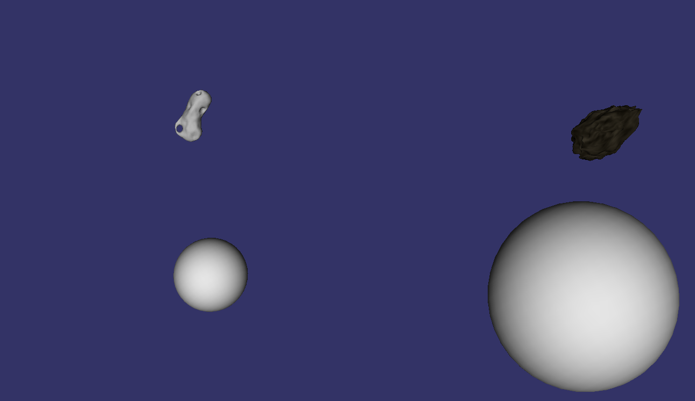

# Project: Asteroid Fields

## Getting Started

### Prerequisites

Windows:
* Download the libraries of OSG from here: http://objexx.com/OpenSceneGraph.html (debug and release if you want to build in both)
* Extract to <path_to_osg>/ (I pasted release and debug in the same, since they use a "d" as postfix for each files => no problems with overwritting etc)
* Use Path-variable to <path_to_osg>/bin

Ubuntu:
* Install the libraries with "sudo apt-get install openscenegraph
 libopenscenegraph-dev"
* For the examples one can use "sudo apt-get install openscenegraph-examples". These can then simply called by the command "osgteapot" for example.
* Includes should be at "/usr/include" and libraries at "/usr/lib/x86_64-linux-gnu" (at least for me.. ;-) )

### Project-setup
I suggest to use the cmake-gui, since it most likely does not find the variables autoamtically, so it might be easier to set them correctly.

* Specify the location for source to "physSim/project/code" and for binaries to "physSim/project/code/build".
* Hit configure (Windows => make sure to select 64Bit-version)
* Verify or set these variables:
    * OPENSCENEGRAPH_INCLUDE_DIR:
        * Windows: <path_to_osg>/include
        * Ubuntu: /usr/include
    * OPENSCENEGRAPH_LIB_DIR:
        * Windows: <path_to_osg>/lib
        * Ubuntu: /usr/lib/x86_64-linux-gnu (for me)
* Generate

Open the project, build and run it and enjoy :-)
Verify that the path to the models in "config.h" is set to the correct folder (should already, but you never know).

## Structure 
I added two asteroid (3d obj models) and two planets (simple spheres). Both implemented in the classes Asteroid, and Planet respectively. So far it is really basic and I will continue with working on the look and feel of the whole scene => nicer background than violet and so on :-)

The structure is meant to be like this:
* Core: main loop, path config, ...
* Physics: All physics calculations (Collision-handling, NBody-handling, ...)
* Scene: Used for all rendering things as well the objects which holds the information about the space-objects. Scene-manager to make load the scene (later with parameters or scene-file) and keep track of objects.
* Visitors: not yet used. Basically for OSG visitors are a cool concept to spread calculations among the tree.

